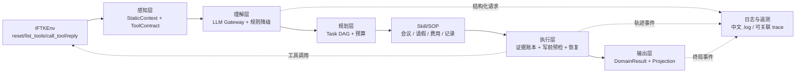

# NL2Workflow 企业流程 Agent

这是面向科大讯飞 NL2Workflow 企业流程 Agent 竞赛的纯 Python 实现。项目以
`dev/newman` 为当前主线：模型负责自然语言中的变化部分，程序负责可验证、不可变的
业务流程。当前已记录的线上隐藏集最高分为 **78.92386**，排名 **11 / 459**。

## 比赛与参考资料

- [科大讯飞 NL2Workflow 竞赛主页](https://challenge.xfyun.cn/topic/info?type=NL2Wf&option=tjjg)
- [官方模拟器说明](contest/simulator/README.md)
- [提交规范](contest/simulator/docs/submission_spec.md)
- [本地测试指南](contest/simulator/docs/local_test_guide.md)
- [流程、会议室与跨域题型说明](contest/simulator/docs/)
- [参考项目：kan_shan_nursery](https://github.com/Nai1ve/kan_shan_nursery)

比赛页面、模拟器文档和提交规范是外部契约；仓库内的实现和测试以这些契约为准。

## 当前结果

| 项目 | 记录 |
| --- | --- |
| 线上隐藏集最高分 | **78.92386** |
| 线上排名 | **11 / 459** |
| 当前代码主线 | `dev/newman` |
| 本次 README 更新基线 | `af5888a`（`feat: advance v3 conflict isolation and diagnostics`） |
| 评测接口 | `MyAgent(env).run(case_id) -> dict` |

分数是线上隐藏集的历史最高记录，不能当作本地 Train/Val 的保证值；每次提交前仍应使用
官方 runner 做回归。

## 核心思路

企业流程题同时包含开放语义和严格契约。项目把两者明确分开：

1. **模型控制变化**：任务拆分、粗粒度意图识别、原文语义实体抽取，以及候选集合中的
   语义排序。
2. **SOP 控制不变流程**：工具顺序、字段依赖、日期/金额计算、权限和冲突检查、写前
   确认、失败恢复、结果验证。
3. **运行时事实优先**：`tool_specs`、Workflow Schema、人员/项目/物料候选和会议室
   可用性以当前环境返回为准；静态索引只提供先验和检索结构。
4. **证据驱动写入**：模型不能创造 ID、枚举、金额或房间 UUID。所有写参数必须能追溯
   到用户事实、多轮回复、实时工具结果或显式任务输出。
5. **不做数据泄漏**：代码不读取 Case 的金标准、参考答案、成功条件或题目 ID 来决定
   业务路径；无法由运行时信息判定的评测冲突被隔离到兼容档位。

## 解决方案与执行链路

每个 case 都重新建立上下文、事实账本、任务图和预算，生命周期如下：

```text
env.reset / env.list_tools
        ↓
静态索引加载 + 运行时工具契约对账
        ↓
LLM 任务拆分 / 意图识别（结构化 JSON）
        ↓
TaskGraphIR → 合法化 TaskSpec → 纯 Python Task DAG
        ↓
绑定稳定 Skill/SOP 子图
        ↓
候选查询、事实绑定、预检、澄清、写入与失败恢复
        ↓
领域状态验证 → DomainResult → 晚绑定 Projection
        ↓
final_answer + 运行轨迹日志
```

### 系统架构



这里的 DAG 是项目内的确定性调度器，不依赖 LangGraph。DAG 只描述任务和节点依赖；
Skill 内部的重试、冲突恢复和阻断分支仍然是无环的有限状态流转。

## 分层实现

### 感知层：静态先验与实时契约

`submission2/static_context/` 保存由公开数据编译出的索引：

- `tools.index.json`：工具名称、参数 Schema、读写风险和成本；
- `workflows.index.json`：流程目录、字段类型、必填项、枚举和依赖；
- `meetingrooms.index.json`：会议室的位置、容量、设备和反向索引；
- `manifest.json`：资源版本和来源哈希。

`StaticContextStore` 只提供目录和排序先验。每次 `run()` 调用 `env.list_tools()`，由
`ToolContractReconciler` 对账；未公开工具、非法参数、权限问题和不满足写入条件的调用在
`env.call_tool()` 之前被拦截。

### 理解层：短语抽取而非答案生成

`IntentRecognizer` 使用统一 LLM Gateway 把用户请求拆成 `meeting`、`leave`、`budget`
等粗粒度任务单元。各 Skill 再对自己的领域短语进行结构化抽取。

- 输出经过 JSON Schema 校验，传输/解析失败最多重试一次，然后走确定性降级；
- 模型输出原文短语或候选索引，不输出工具名、工作流 ID、人员 ID、项目编码或房间 UUID；
- 日期、时长、金额、枚举绑定由代码和实时候选完成；
- 语义不足时可以澄清或阻断，不使用“第一候选”猜测。

### 规划与执行层：Task DAG + 证据账本

`TaskDag` 使用 `PENDING → READY → RUNNING → SUCCEEDED/BLOCKED/FAILED/SKIPPED` 状态
推进节点。关系区分为：

- `order_after`：只表达用户请求顺序，前任务阻断不抹掉独立后任务；
- `requires`：后任务确实依赖前任务的显式输出，缺事实时才澄清或阻断。

`CaseContext` 和 `EvidenceLedger` 只存在于一个 case 内。跨任务事实必须作为显式
`DomainResult` 传递；`INFERRED` 事实只能用于排序，不能直接驱动写操作。接近
`step_budget` 或遇到 `StepLimitExceeded` 时，执行器返回已有合法结果，不让异常逃出
`MyAgent.run()`。

### 输出层：领域事实与提交投影分离

Skill 先生成领域结果，再由 Projector 生成官方 `final_answer`，避免跨域或递归字典合并
覆盖字段。会议结果同时保留真实工具 ID、语义楼栋、订单号和取消的旧订单；工作流结果
保留流程 ID、提交/草稿状态、字段和记录 ID。兼容字段只能引用同一份事实，不能构造第二
套业务状态。

## Skill 目录

| Skill | 主要能力 | 固定流程摘要 |
| --- | --- | --- |
| `MeetingSkill` / `MeetingroomExecutor` | 查询、预订、取消、延长、换大房、重订、参会人、多日期与最近位置 | 定位/候选 → 冲突与权限过滤 → 排序或回退 → 写前预检 → 写入 → 状态验证 |
| `LeaveSkill` | 请假草稿/提交、假种/原因、时段与时长、审批人、替换/删除 | Schema → 日期时长计算 → 候选绑定 → 预检 → 保存/提交 → 验证 |
| `BudgetSkill` | 费用/物资项目、类别、小类、数量单价与明细守恒 | Catalog/Schema → 项目和类别候选 → 明细绑定 → 金额守恒 → 保存/提交 |
| `WorkflowRegistry` / 记录流程 | Workflow Schema、字段依赖、记录查询和删除保护 | 实时 Schema 驱动合法字段；写后验证并保留 evidence |

会议的“最近”“下周哪天”“连续空档”等属于 Skill 内的可复用算子，而不是为每道题创建
一个复合 Skill。请假时间使用标准工作配置和可切换的 Calendar Profile；费用的项目、
类别和小类始终从本轮工具候选选择。

## 数据、配置与安全

三类数据的权威顺序为：

```text
用户明确事实 → 多轮回复 → 实时工具结果 → Workflow Schema
→ 公司业务配置 → 兼容策略 → legacy fallback / blocked
```

训练集、验证集和本地配置不进入 Git。模型配置按 `config.json`、本地未提交配置和环境
变量合并，推荐使用 `OPENAI_API_KEY`、`OPENAI_BASE_URL`、`OPENAI_MODEL`。密钥不会写入
日志、静态索引、`final_answer` 或默认提交包；仅供本地联调的带 key 包必须单独生成并
保持在未跟踪目录。

## 日志与诊断

运行时同时向控制台和普通 UTF-8 `.log` 输出中文单行事件，覆盖：任务归一化、事实写入、
LLM 请求/解析、候选集与淘汰原因、工具参数和结果、追问、写前预检、DomainResult、
Projection、自检和 case 终止。每条记录带 `run/case/task/stage`，可用 `AGENT_LOG_FILE`
指定日志文件。日志会做基本脱敏，不记录 API key、Authorization、Cookie 和临时下载
token；工具 ID 和选中候选保留用于复盘。

## 目录结构

```text
.
├── README.md                         # 项目说明（本文件）
├── technical_design.md               # 目标架构与比赛约束
├── contest/
│   └── simulator/                    # IFTKEnv、官方 runner、evaluator、题型文档
├── submission2/                      # 当前 V2 源码，打包时映射为 submission/
│   ├── my_agent.py                   # 官方入口 MyAgent
│   ├── static_context/               # 编译后的工具/流程/会议室索引
│   ├── utils/                        # context、DAG、Skills、LLM、投影和日志
│   └── docs/                         # 架构、契约、SOP、评分、测试文档
├── scripts/
│   ├── build_static_context.py       # 编译静态索引
│   ├── run_agent.py                  # 本地 runner 包装器
│   └── package_submission.py          # 官方 submission zip 构建与检查
└── tests/                            # 单元、契约、Skill 和运行时测试
```

## 开发与测试

### 安装

需要 Python 3.11。模拟器会安装 `contest/simulator/requirements.base.txt` 中的预装依赖；
提交包运行时仅依赖标准库和平台允许的白名单库。

```bash
python3.11 -m venv .venv
source .venv/bin/activate
pip install -r contest/simulator/requirements.base.txt pytest
```

首次运行前，把公开数据放入被 gitignore 的 `contest/train` 和 `contest/val`，然后编译索引：

```bash
PYTHONPATH=submission2 .venv/bin/python scripts/build_static_context.py
```

### 单元与冒烟

```bash
PYTHONPATH=submission2 .venv/bin/python -m pytest tests/ -q
PYTHONPATH=submission2 .venv/bin/python scripts/run_agent.py \
  --split val --agent submission2/my_agent.py \
  --case beta_mr_wf_0006 --skip-variants --timeout 60 --verbose
```

### Train / Val 全量回归

```bash
AGENT_EXECUTION_PROFILE=hybrid_compat \
PYTHONPATH=submission2 .venv/bin/python scripts/run_agent.py \
  --split train --agent submission2/my_agent.py --parallel 4 --timeout 60 \
  --skip-variants --output reports/runs/v2_train.json \
  --log-output reports/runs/v2_train.stdout

AGENT_EXECUTION_PROFILE=hybrid_compat \
PYTHONPATH=submission2 .venv/bin/python scripts/run_agent.py \
  --split val --agent submission2/my_agent.py --parallel 4 --timeout 60 \
  --skip-variants --output reports/runs/v2_val.json \
  --log-output reports/runs/v2_val.stdout
```

Gold 冲突审计只允许离线运行，不会被 `MyAgent` 导入：

```bash
PYTHONPATH=submission2 .venv/bin/python scripts/audit_conflicts.py \
  --output reports/conflict_audit_v2.log
```

## 生成提交包

官方入口必须位于 zip 内的 `submission/my_agent.py`。打包脚本会把 `submission2/` 映射到
`submission/`，剔除文档、训练数据、报告、缓存、日志和本地配置，并检查入口、文件大小、
路径和疑似密钥：

```bash
python scripts/package_submission.py \
  --output submission2/dist/submit_v2.zip
```

本地提交联调若确实需要把当前 key 写入包，可使用 `--include-key`；该 zip 只用于本地或
平台测试，不要提交 Git、不要公开分享：

```bash
python scripts/package_submission.py --include-key \
  --output submission2/dist/submit_v2_with_key.zip
```

## 分支与发布约定

- `main` 与 `dev/newman` 保持同一条发布主线；提交前以 `dev/newman` 的代码和测试为准。
- `legacy_current`、`hybrid_compat`、`generic_v2` 是运行档位；不确定的历史评测冲突应
  隔离在兼容档位，不污染通用业务规则。
- 线上提交前保留上一个可用 zip、代码提交哈希和回归报告；隐藏集退化时先回滚档位，
  再分析日志，不通过题目 ID 或答案常量补分。

## 后续补充

图片暂不随本次提交加入，预留以下位置供后续补充排行榜截图和架构图：

```text
docs/assets/leaderboard.png
docs/assets/architecture.png
```

> 公众号链接：待补充
